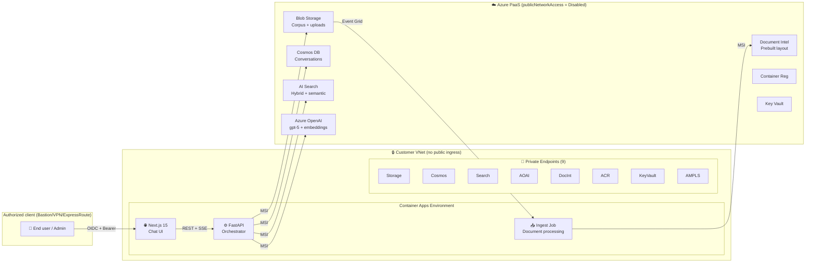
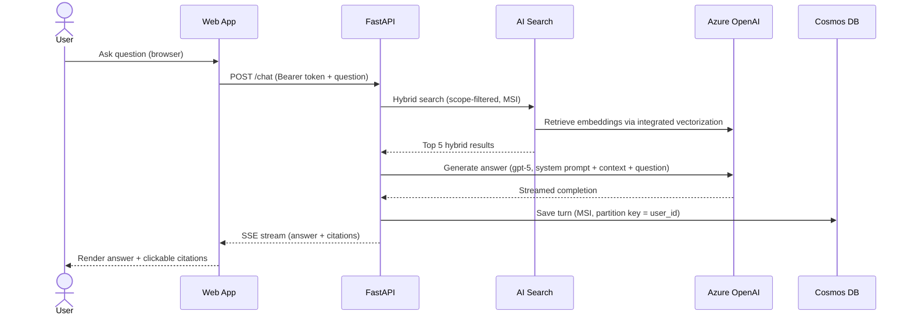

# Private RAG Accelerator on Azure

> A **zero-trust**, **completely private** RAG solution on Azure. Ingest complex documents (PDFs, images, Office files) → generate semantic embeddings → run grounded Q&A with GPT-5 over your own data, all inside a customer VNet with no public endpoints. Deploy in <15 minutes hands-on with a single `azd up` command. Default cost: **~$318/mo idle**.

---

## 📊 Status & Tech Stack

[](docs/deploy.md)
[](LICENSE)
[](infra/AVM-AUDIT.md)
[](pyproject.toml)
[](apps/web/package.json)

---

## 🎯 What This Solves

**Customer need:** Private-sector organizations (healthcare, government, legal) demand grounded Q&A over sensitive documents—but *zero tolerance* for data egress to the public internet.

**This accelerator delivers:**
- **No public endpoints** — every Azure service locked to a Private Endpoint inside a customer VNet  
- **No shared keys** — every service-to-service call uses Managed Identity (MI) with least-privilege RBAC  
- **No static credentials** — Entra ID-only authentication end-to-end  
- **Production-grade RAG** — semantic search + hybrid ranking + integrated vectorization (no separate embedding pipeline)  
- **Complex documents** — PDFs with embedded images, Office files, scanned forms all supported via Document Intelligence prebuilt-layout  
- **Citations + traceability** — every answer links back to source passages; end-user can click through to the original document  

**What ships in the box:**
- **Compute:** Azure Container Apps (web UI, FastAPI backend, async ingest job)  
- **Search:** Azure AI Search (semantic + hybrid + integrated vectorization with GPT-5)  
- **Database:** Cosmos DB NoSQL (conversations, document metadata, ingestion status)  
- **AI models:** Azure OpenAI (gpt-5 + text-embedding-3-large)  
- **Document processing:** Document Intelligence (prebuilt-layout for PDFs/images)  
- **Network:** VNet with hub-spoke topology, 13 Private DNS zones, Private Endpoints for every service  
- **Access:** Azure Bastion (Developer SKU) + optional jumpbox for secure browsing  
- **IaC:** Bicep + Azure Verified Modules (AVM) — infrastructure-as-code, fully idempotent  
- **Observability:** Application Insights + Log Analytics + budget alerts  

**What's NOT in scope** (by design):
- Multi-tenant isolation across subscriptions (single-tenant per deployment)  
- Fine-tuned models (use base GPT-5 + your own corpus)  
- Hybrid on-prem connectivity (peer your own ExpressRoute / VPN into the deployed VNet)  
- HIPAA/FedRAMP compliance automation (the architecture *supports* these controls; compliance validation is yours)  

For deep architecture detail, see [**docs/architecture.md**](docs/architecture.md).  
For cost breakdown and optimization levers, see [**docs/cost.md**](docs/cost.md).

---

## ⚡ TL;DR Onboarding (< 15 min hands-on)

**Prerequisites:** Windows PowerShell 7+ or bash. One-time tool install:
```powershell
winget install -e --id Microsoft.AzureCLI Microsoft.AzureDeveloperCLI Microsoft.PowerShell
# then verify:
az --version && azd --version && bicep --version
```

**Deploy in 5 steps:**

```powershell
# 1. Clone the repo
git clone https://github.com/Arbyam/private-link-rag-accelerator.git
cd private-link-rag-accelerator
git checkout 001-private-rag-accelerator   # until merged to main

# 2. Log in to Azure
az login --tenant <YOUR_TENANT_ID>
az account set --subscription <YOUR_SUBSCRIPTION_ID>
azd auth login --tenant-id <YOUR_TENANT_ID>

# 3. Create an environment (pick a globally-unique short name)
azd env new dev-yourname
azd env set AZURE_LOCATION eastus2                              # gpt-5 + AI Search S1 region
azd env set NAMING_PREFIX pria                                  # 4-char resource prefix
azd env set ADMIN_GROUP_OBJECT_ID <your-entra-group-oid>       # admin group
azd env set ALLOWED_USER_GROUP_OBJECT_IDS '<oid1>,<oid2>'      # optional; empty = all tenant

# 4. Run preflight validation
pwsh ./scripts/preflight.ps1                                    # checks quotas, CLI versions, RBAC

# 5. Deploy
azd up                                                           # ~35–45 min wall-clock, ~5 min hands-on
```

**After deployment:** `azd` prints a VNet-internal URL (e.g., `https://web.pria-dev-yourname.eastus2.azurecontainerapps.io`). To access it:
- Via **Azure Bastion** (default): `azd env get-values | Select-String BASTION` → open jumpbox, browse from there  
- Via **your VPN/ExpressRoute**: peer your network to the deployed VNet (see [docs/deploy.md § Reaching the Chat UI](docs/deploy.md))

**Smoke test (2 min):**  
1. Sign in with an Entra ID account.  
2. Click **New chat** → ask *"What does the sample HR policy say about remote work?"*  
3. Watch the assistant return a grounded answer with citations.  
4. Click a citation → the PDF opens to the cited page.  

✅ You've verified FR-001 (grounded Q&A), FR-002 (no public endpoints), and FR-003 (Managed Identity everywhere).

For the full walkthrough, see [**docs/deploy.md**](docs/deploy.md).

---

## 🏗️ Architecture

### System Context (High Level)



### Request Flow (Chat Turn)



### Document Ingestion Flow

```mermaid
flowchart LR
    Admin["📁 Admin drops PDF/image<br/>into shared-corpus"]
    Admin -->|Blob event| EventGrid["Event Grid"]
    EventGrid -->|Queue message| Job["Ingest Job<br/>(Container Apps Job)"]
    Job -->|Document Int<br/>prebuilt-layout| DocInt["Extract text + layout"]
    DocInt -->|Chunking<br/>+ embeddings| SEARCH["AI Search<br/>index update"]
    SEARCH -->|Metadata| COSMOS["Cosmos<br/>track status"]
    COSMOS -->|Poll status| UI["Web UI<br/>shows indexed ✓"]
```



For full architecture docs (request flow, ingest details, network topology), see [**docs/architecture.md**](docs/architecture.md).

---

## 🛡️ Security Posture — 7 Zero-Trust Guarantees

Every guarantee below is **machine-checked** by the static test suite (`infra/tests/`). No public endpoints = no blast radius. No shared keys = no credential sprawl. No exceptions.

| Guarantee | Enforcement | Verification |
|-----------|-------------|--------------|
| **No public endpoints** | Every PaaS service has `publicNetworkAccess: 'Disabled'` | `infra/tests/test_no_public_endpoints.ps1` (T050) |
| **No shared keys** | No `listKeys()`, `connectionString`, or static account keys in Bicep | `infra/tests/test_no_shared_keys.ps1` (T051) |
| **Private DNS for every PE** | 13 Private DNS zones linked to VNet; all 9 PEs resolve internally | `infra/tests/test_dns_zones.ps1` (T052) |
| **Managed Identity everywhere** | Every service-to-service call uses MSI + RBAC role assignments | Runtime validation in `docs/security-posture.md` (SC-010) |
| **VNet-only ingress** | No public IPs on web tier; Bastion tunnels + jumpbox in subnet | Network rules in `infra/modules/networking/main.bicep` (PR #22) |
| **Entra ID-only auth** | Chat UI uses OIDC → Entra; API validates Bearer tokens | `apps/web/auth.config.ts` (PR #26), `apps/api/auth.py` (PR #27) |
| **Per-user search isolation** | API scope-filters every search to `user_id` at query time | `apps/api/src/services/search.py:query_with_scope_filter()` (SC-011 / PR #28) |

Run the static tests (60 seconds, no Azure cost):
```powershell
pwsh ./infra/tests/run-all.ps1
```

Expected output: **52 tests pass**. Any failure = zero-trust posture breach → abort.

For details on threat model and architecture decisions, see:
- [**docs/security-posture.md**](docs/security-posture.md) — full audit checklist  
- [**docs/decisions/0005**](docs/decisions/0005-single-search-index-with-scope-filter.md) — why per-user isolation works in a single index  
- [**docs/decisions/0007**](docs/decisions/0007-avm-where-possible.md) — Verified Module policy (gates unsafe resource configs)

---

## 💰 Cost — Default Deployment

| Item | SKU | $/mo |
|------|-----|-----:|
| **VNet + DNS zones** | 13 zones | $7 |
| **Bastion** | Developer (free) | $0 |
| **Jumpbox** | Standard_B2s (Linux, deallocate when idle) | $36 |
| **Container Registry** | Premium (only tier with PE support) | $50 |
| **AI Search** | Basic (lowest with semantic ranker + PE) | $74 |
| **API Management** | Developer (internal VNet) | $50 |
| **Container Apps** | Consumption (scale-to-zero) | $5 |
| **Cosmos DB** | Serverless (pay-per-RU) | $3 |
| **Azure OpenAI** | gpt-5 + text-embedding-3-large (pay-per-token) | $10 |
| **Document Intelligence** | S0 (lowest with PE support) | $3 |
| **Storage** | Standard LRS (2 containers) | $3 |
| **Key Vault** | Standard (RBAC) | $1 |
| **Log Analytics** | Pay-per-GB (30-day retention) | $8 |
| **Application Insights** | Workspace-based | $2 |
| **Private Endpoints** | 9 × $7.30/mo | $66 |
| **TOTAL (idle)** | — | **$318/mo** |

**At traffic:** Azure OpenAI (pay-per-token) and Document Intelligence (pay-per-page) scale with usage. Typical demo session = <$1.

**Production mode** (opt-in toggles, see [**docs/cost.md § Production Mode**](docs/cost.md)):
- APIM Premium (SLA) +$2,750/mo  
- AI Search S1 (HA) +$176/mo  
- Bastion Standard (always-on) +$140/mo  
- Cosmos provisioned (predictable spend) ~$25–$200+/mo  
- Zone redundancy + CMK — variable  
- **Net production total: ~$3,300/mo** (+ AOAI PTUs if needed)

**Cost levers (save money):**
1. Deallocate jumpbox when not in use → saves $36/mo  
2. Set `DEPLOY_BASTION=false` if you have existing VPN/ExpressRoute  
3. Use customer-provided DNS (`CUSTOMER_PROVIDED_DNS=true`) → saves $7/mo  

For detailed breakdown, see [**docs/cost.md**](docs/cost.md).

---

## 🚀 Onboarding by Audience

### Solution Engineers (Deploy + Demo)

**Your goal:** Stand up a demo, walk a customer through security posture, show a grounded Q&A.

1. **Read:** [**docs/deploy.md**](docs/deploy.md) — full `azd up` walkthrough + Bastion access + smoke test  
2. **Run static tests:** `pwsh ./infra/tests/run-all.ps1` (52 checks, <1 min, $0)  
3. **Walk security posture:** [**docs/security-posture.md**](docs/security-posture.md) + the 7-bullet checklist above  
4. **Demo script:** Load sample documents → ask 3 questions with citations → show per-user isolation  
5. **Reference architecture decisions:** [**docs/decisions/0001** through **0007**](docs/decisions/)  

**Cost to run a 1-week demo:** ~$350. **Time to deploy:** 45 min. **Time to first grounded answer:** 50 min.

### Developers (Extend + Customize)

**Your goal:** Add custom endpoints, new document types, custom UI branding.

**Repo layout:**
```
apps/
  ├── web/               — Next.js 15 chat UI + Auth.js v5 (PR #26)
  ├── api/               — FastAPI backend (Python 3.12) + Pydantic (PR #27 / #28)
  └── ingest/            — Async job for document ingestion (PR #29)
infra/
  ├── main.bicep         — orchestration (PR #22)
  ├── modules/           — AVM-wrapped services (networking, search, cosmos, etc.)
  └── tests/             — static + runtime test suite (T048–T053)
docs/
  ├── architecture.md    — deep-dive request/ingest flows
  ├── cost.md            — SKU choices + production toggles
  ├── deploy.md          — `azd up` walkthrough
  ├── security-posture.md — audit checklist
  └── decisions/         — architecture decision records (ADRs)
specs/                   — Spec Kit SDD (source-of-truth spec + plan + tasks)
scripts/
  ├── preflight.ps1      — validation gate (T056)
  └── postprovision.ps1  — kb-index seed + sample docs (T047)
```

**Local dev loop:**

```powershell
# Backend API
cd apps/api
pip install -e .
pytest                 # run tests
python -m fastapi.cli run --reload

# Web UI
cd apps/web
npm install
npm run dev            # Next.js dev server on http://localhost:3000

# Ingest job (runs on every blob in shared-corpus)
cd apps/ingest
pip install -e .
python -m ingest.main   # test locally against a single PDF
```

**Adding a new endpoint:**
1. Add a route to `apps/api/src/routes/*.py` with the `@router.post()` decorator  
2. Register the router in `apps/api/src/main.py`  
3. Call it from the web UI via `fetch('/api/v1/...')` with a Bearer token  
4. Scope all search queries with `query_with_scope_filter(user_id, query_text)`  

**Adding a new ingestion handler:**
1. Extend `apps/ingest/src/handlers/` with a new class for your file type  
2. Register in `apps/ingest/src/main.py:handle_document()`  
3. Chunk, vectorize, and write to AI Search via MSI  

**Customizing the UI brand:**
1. Edit `apps/web/src/app/(theme)/tokens.css` (1 file, all design tokens)  
2. Next build + redeploy via `azd deploy`  

**Source of truth for work:** [`specs/001-private-rag-accelerator/`](specs/001-private-rag-accelerator/) — spec.md, plan.md, tasks.md all live here. Read them before adding features.

### Security Architects (Audit + Harden)

**Your goal:** Validate zero-trust posture, harden for production, sign off on compliance.

1. **Skim the 7-bullet security posture** above — that's your headline  
2. **Run the static test suite:** `pwsh ./infra/tests/run-all.ps1` (52 automated checks)  
3. **Review per-user isolation design:** [**docs/decisions/0005**](docs/decisions/0005-single-search-index-with-scope-filter.md)  
4. **Verify AVM module policy:** [**infra/AVM-AUDIT.md**](infra/AVM-AUDIT.md) (pinned, versioned, reviewed)  
5. **Walk the request flow:** [**docs/architecture.md § Request Flow**](docs/architecture.md) — every hop uses MSI, every DNS resolves to private IP  
6. **Check production toggles:** [**docs/cost.md § Production Mode**](docs/cost.md) — zone redundancy, CMK, APIM Premium all opt-in  

**Key compliance enablers:**
- **Network isolation:** Private Endpoints + private DNS + VNet-only ingress (FR-002 / SC-010)  
- **Identity & access:** Entra ID + MI + RBAC + per-user scope filters (FR-003 / FR-004 / SC-011)  
- **Data at rest:** Customer Managed Keys (CMK) on Storage, Cosmos, Key Vault (opt-in, no extra code)  
- **Observability:** Application Insights + Log Analytics (all telemetry stays in-VNet via AMPLS)  
- **Budget controls:** Automated alerts at 80% / 100% of monthly budget (D13 / SC-009)  

**Escalation path:** Any architectural question → file a decision record in [**docs/decisions/**](docs/decisions/). Any threat → open an issue against [**specs/001-private-rag-accelerator/spec.md**](specs/001-private-rag-accelerator/spec.md).

---

## 📚 Repository Map

```
.
├── README.md (this file)
├── LICENSE                          — MIT license
├── azure.yaml                        — azd orchestration manifest
├── pyproject.toml                    — Python dev tools (pytest, ruff, etc.)
│
├── apps/
│   ├── web/                          — Next.js 15 chat UI (PR #26)
│   │   ├── src/app/(theme)/          — design tokens, layouts
│   │   ├── auth.config.ts            — Auth.js v5 OIDC config
│   │   └── Dockerfile
│   ├── api/                          — FastAPI backend (PR #27 / #28)
│   │   ├── src/main.py               — routes, middleware
│   │   ├── src/services/search.py    — query_with_scope_filter()
│   │   ├── src/models/               — Pydantic schemas
│   │   └── Dockerfile
│   └── ingest/                       — Async document job (PR #29)
│       ├── src/main.py               — event grid handler
│       ├── src/handlers/             — PDF, image, Office handlers
│       └── Dockerfile
│
├── infra/
│   ├── main.bicep                    — orchestration module (PR #22)
│   ├── modules/
│   │   ├── networking/               — VNet, NSGs, Private DNS zones
│   │   ├── search/                   — AI Search + semantic ranker
│   │   ├── cosmos/                   — Cosmos DB NoSQL
│   │   ├── aoai/                     — Azure OpenAI
│   │   ├── acr/                      — Container Registry (Premium)
│   │   ├── aca/                      — Container Apps Environment
│   │   ├── bastion/                  — Bastion + jumpbox
│   │   └── ... (other AVM wrappers)
│   ├── tests/
│   │   ├── run-all.ps1               — master test runner
│   │   ├── test_compile.ps1          — (T048) Bicep lint
│   │   ├── test_no_public_endpoints.ps1 — (T050) FR-002
│   │   ├── test_no_shared_keys.ps1   — (T051) FR-003
│   │   ├── test_dns_zones.ps1        — (T052) FR-005
│   │   ├── test_what_if_idempotent.ps1 — (T049) SC-002
│   │   └── test_teardown.ps1         — (T053) SC-003
│   ├── search/
│   │   └── kb-index.json             — AI Search index schema
│   └── AVM-AUDIT.md                  — verified module pinning
│
├── docs/
│   ├── architecture.md               — system context, request flow, ingest flow
│   ├── cost.md                       — SKU breakdown, production toggles
│   ├── deploy.md                     — full azd up walkthrough
│   ├── security-posture.md           — audit checklist
│   └── decisions/                    — architecture decision records
│       ├── 0001-aca-over-app-service.md
│       ├── 0002-cosmos-nosql-over-postgres.md
│       ├── 0003-gpt5-over-gpt4o.md
│       ├── 0004-integrated-vectorization.md
│       ├── 0005-single-search-index-with-scope-filter.md
│       ├── 0006-bastion-with-jumpbox-for-vnet-access.md
│       └── 0007-avm-where-possible.md
│
├── scripts/
│   ├── preflight.ps1                 — (T056) validation gate
│   ├── preflight.sh                  — POSIX equivalent
│   ├── postprovision.ps1             — (T047) kb-index + sample seeding
│   └── postprovision.sh              — POSIX equivalent
│
├── specs/
│   └── 001-private-rag-accelerator/  — Spec Kit SDD (source of truth)
│       ├── spec.md                   — functional + security requirements
│       ├── quickstart.md             — hands-on deployment walkthrough
│       ├── plan.md                   — phase breakdown + milestones
│       ├── research.md               — design exploration notes
│       └── tasks.md                  — actionable task list (135 tasks, 11 phases)
│
├── samples/
│   └── *.pdf, *.txt                  — sample documents for smoke test
│
├── .squad/
│   ├── team.md                       — Squad operating rules
│   ├── agents/                       — agent charters (Ripley, Dallas, Kane, etc.)
│   └── decisions.md                  — team coordination notes
│
└── .devcontainer/                    — Docker image + dev tool bootstrap
```

---

## 🤝 Contributing

**Branch strategy:** Work off `001-private-rag-accelerator` (the feature branch; not yet merged to `main`). Create feature branches with the prefix `phase-N/` (e.g., `phase-4/scribe-readme`, `phase-5/add-jwt-refresh`).

**Every PR must:**
- Reference task IDs in the commit message (e.g., `Closes T042, T043`) — see [`specs/001-private-rag-accelerator/tasks.md`](specs/001-private-rag-accelerator/tasks.md)  
- Pass the static test suite: `pwsh ./infra/tests/run-all.ps1` → exit 0  
- Include a description of what problem it solves (link to the ADR if it's an architecture change)  
- Cite evidence of zero-trust preservation: "No new public endpoints ✓", "All service auth via MSI ✓", etc.  

**Pull request template** enforces these rules automatically (see `.github/pull_request_template.md`).

For team operating rules, see [**.squad/team.md**](.squad/team.md).  
For Squad member charters and decision escalation, see [**.squad/agents/**](.squad/agents/).

---

## 📜 License

This project is licensed under the **MIT License**. See the [LICENSE](LICENSE) file for details.

---

## 🔗 Next Steps

- 🚀 **Deploy:** Follow [**docs/deploy.md**](docs/deploy.md)  
- 🔍 **Understand the architecture:** Read [**docs/architecture.md**](docs/architecture.md)  
- 💡 **Design decisions:** Browse [**docs/decisions/**](docs/decisions/)  
- 📋 **Cost planning:** See [**docs/cost.md**](docs/cost.md)  
- 👥 **Extend for your use case:** Check [**specs/001-private-rag-accelerator/**](specs/001-private-rag-accelerator/) for the roadmap  
- 🤖 **Contribute:** See [Contributing](#-contributing) above  

---

**Questions?** Open an issue on GitHub. **Security concerns?** File a private vulnerability report via GitHub Security Advisory. **Feature requests?** Create a discussion or file an issue with the label `enhancement`.

---

*This README is the front door. Everything inside the repo is reachable via the links above. Trust the navigation.*
