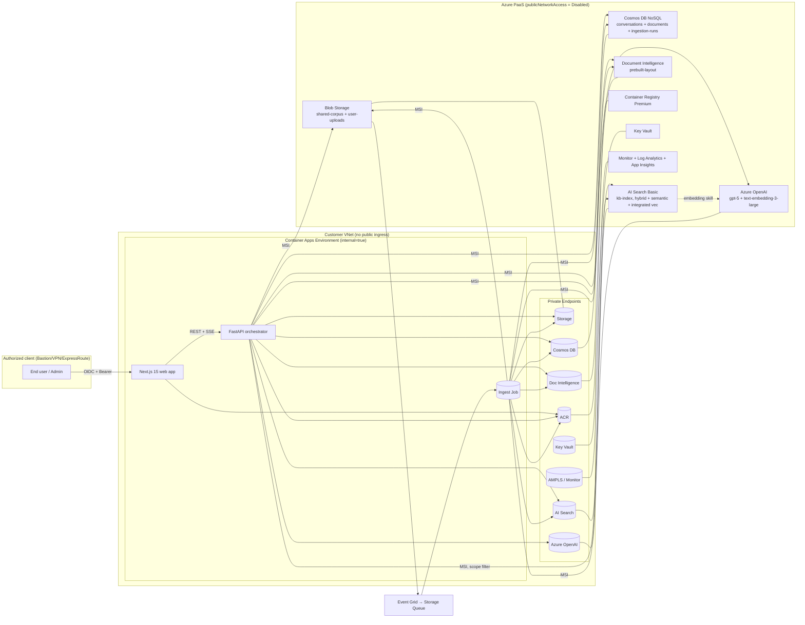
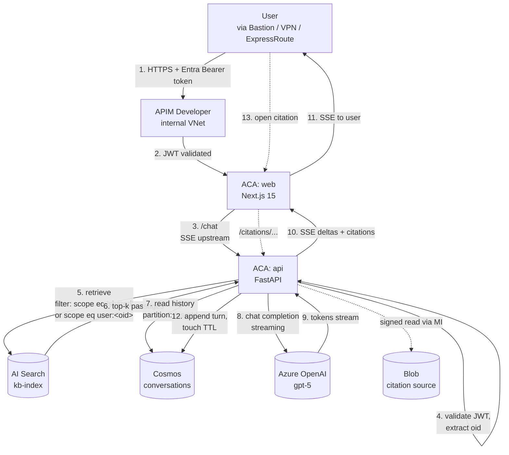
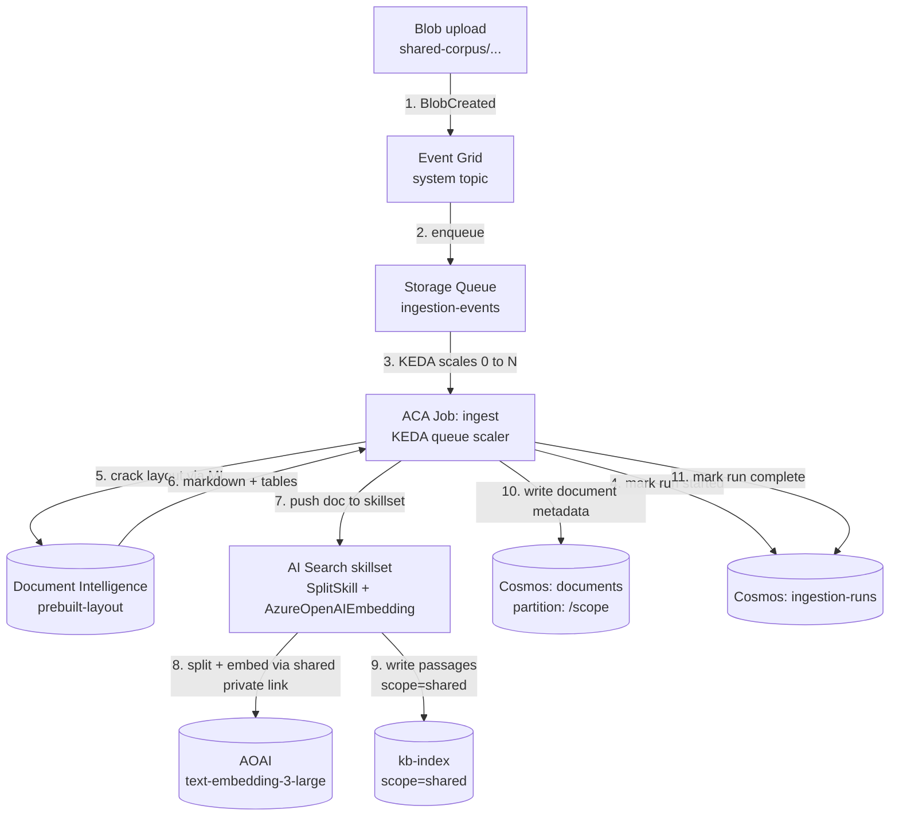

# Architecture

This document describes the as-deployed architecture of the Private RAG
Accelerator at three levels of zoom:

1. **System context** — the canonical high-level diagram from
   [`quickstart.md` §9](../specs/001-private-rag-accelerator/quickstart.md).
2. **Request flow** — what happens when an authenticated user sends a chat
   turn.
3. **Ingest flow** — what happens when a blob is dropped into the
   `shared-corpus` container.

For decisions and trade-offs that produced this shape, see
[`docs/decisions/`](decisions/). For the resulting cost picture, see
[`docs/cost.md`](cost.md).

---

## 1. System context

Source: [`specs/001-private-rag-accelerator/quickstart.md` §9](../specs/001-private-rag-accelerator/quickstart.md).

> Note: AI Search runs at **Basic** in the default deployment — the lowest
> tier supporting Private Endpoint. The diagram in `quickstart.md` §9
> labels it "S1" against the spec baseline; the as-deployed figure is
> Basic per the Phase 2a v3 cost-validated plan
> ([`.squad/decisions.md`](../.squad/decisions.md), "T024 SKU deviation").

---

## 2. Request flow (chat turn)

What a single user chat turn looks like, end to end. APIM sits between
the client and the ACA web app, providing an internal-VNet AI Gateway
(token-quota, JWT pre-validation, request shaping) before the request
hits Container Apps.

Steps 5 and 12 carry the SC-011 isolation guarantee: the `scope` filter
in the search query and the `/userId` partition on the Cosmos write are
both derived from the **server-validated** Entra `oid` claim — never from
client input (ADR-0005, [data-model §5](../specs/001-private-rag-accelerator/data-model.md)).

All hops marked with a Private Endpoint icon in §1 traverse private
networking; nothing in this flow leaves the customer VNet.

---

## 3. Ingest flow (shared-corpus blob)

Triggered when an admin (or `azd up` post-provision hook) drops a
document into the `shared-corpus` blob container.

Per-user upload flow is the same shape with two differences:

- The blob lands at `user-uploads/{userOid}/{conversationId}/...` instead
  of `shared-corpus/`.
- `scope` on the resulting passages is `user:<oid>` (not `shared`), and
  the `apps/api` orchestrator calls `embeddings.create()` directly rather
  than going through the Search skillset (ADR-0004).

The job's all-or-nothing run record in `ingestion-runs` is the surface
that satisfies FR-013 (admin-visible ingestion status).

---

## 4. Where to read more

- Compute / job topology — [ADR-0001](decisions/0001-aca-over-app-service.md).
- State store — [ADR-0002](decisions/0002-cosmos-nosql-over-postgres.md), [data-model §§2–4](../specs/001-private-rag-accelerator/data-model.md).
- Chat model — [ADR-0003](decisions/0003-gpt5-over-gpt4o.md).
- Embedding pipeline — [ADR-0004](decisions/0004-integrated-vectorization.md), [data-model §5](../specs/001-private-rag-accelerator/data-model.md).
- Cross-user isolation — [ADR-0005](decisions/0005-single-search-index-with-scope-filter.md).
- Admin access — [ADR-0006](decisions/0006-bastion-with-jumpbox-for-vnet-access.md), [quickstart §6](../specs/001-private-rag-accelerator/quickstart.md).
- IaC discipline — [ADR-0007](decisions/0007-avm-where-possible.md), [`infra/AVM-AUDIT.md`](../infra/AVM-AUDIT.md).
- Cost — [`docs/cost.md`](cost.md).
- Networking detail — [research.md D9](../specs/001-private-rag-accelerator/research.md).
