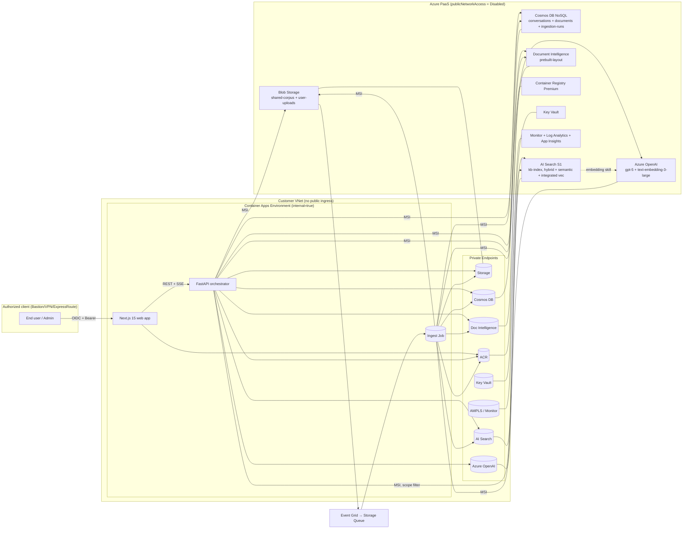

# Quickstart — Private RAG Accelerator

**Audience**: Microsoft Solution Engineer or customer cloud engineer with
Azure Owner (or Contributor + User Access Administrator) on a single
subscription.
**Goal**: Stand up the full private-only RAG environment, ingest a sample
corpus, and ask the first grounded question.
**Target time**: < 60 minutes wall-clock, < 15 minutes hands-on (SC-001).

---

## 1. Prerequisites

### Fast path — GitHub Codespaces (zero local installs)

From the repo on GitHub, click **Code → Codespaces → Create codespace on `main`**.
The shipped `.devcontainer/` boots with `azd`, `az`, `bicep`, `node 22`, `python 3.12`,
`docker`, `gh`, and `pwsh` pre-installed. Skip to §2.

### Local path — VS Code + Dev Containers extension

Install [Docker Desktop](https://www.docker.com/products/docker-desktop/) and the
[Dev Containers](https://marketplace.visualstudio.com/items?itemName=ms-vscode-remote.remote-containers)
extension. Open the cloned repo in VS Code → *Reopen in Container*. Skip to §2.

### Bare-metal path — install everything yourself

| Tool | Min version | Why |
|------|-------------|-----|
| [Azure Developer CLI (`azd`)](https://aka.ms/azd) | 1.13.0 | One-command deploy |
| [Azure CLI (`az`)](https://aka.ms/azurecli) | 2.65.0 | Pre-flight checks |
| [Bicep](https://aka.ms/bicep-install) | 0.30.0 | IaC compile |
| [Docker Desktop](https://www.docker.com/products/docker-desktop/) | 4.30 | Build container images |
| [Node.js](https://nodejs.org) | 22 LTS | Build the web app locally |
| [Python](https://www.python.org/downloads/) | 3.12 | Local API/worker dev |
| `gh` (optional) | 2.50 | Repo + PR workflow |

You also need:

- An Azure subscription where you have **Owner** (or Contributor + User Access
  Administrator) at the subscription scope.
- An Entra ID tenant where you can create app registrations OR an existing
  app registration whose redirect URIs you can edit.
- Quota in your chosen region for: Azure OpenAI **gpt-5** and
  **text-embedding-3-large**, AI Search S1, Cosmos DB, Container Apps
  (vCPU/memory), Bastion. The pre-flight script checks this for you.

---

## 2. Clone & log in

```powershell
git clone https://github.com/Arbyam/private-link-rag-accelerator.git
cd private-link-rag-accelerator
git checkout 001-private-rag-accelerator   # until merged

az login --tenant <YOUR_TENANT_ID>
az account set --subscription <YOUR_SUBSCRIPTION_ID>

azd auth login --tenant-id <YOUR_TENANT_ID>
```

---

## 3. Pick parameters

`azd init` is not required — `azure.yaml` is checked in. Set environment
variables for the deployment:

```powershell
azd env new pria-demo                          # environment name (= resource group prefix)
azd env set AZURE_LOCATION eastus2             # gpt-5 + AI Search S1 known-good region
azd env set NAMING_PREFIX pria                 # 4-char prefix for resource names
azd env set ADMIN_GROUP_OBJECT_ID <entra-group-oid>
azd env set ALLOWED_USER_GROUP_OBJECT_IDS '<oid1>,<oid2>'   # optional; empty = all tenant users
azd env set DEPLOY_BASTION true                # set to false if you have existing Bastion/VPN
azd env set BUDGET_MONTHLY_USD 1000
```

Optional production-mode toggles (off by default — see [`docs/cost.md`](../../docs/cost.md)):

```powershell
azd env set ENABLE_ZONE_REDUNDANCY false
azd env set ENABLE_CUSTOMER_MANAGED_KEY false
azd env set CHAT_MODEL gpt-5
azd env set EMBEDDING_MODEL text-embedding-3-large
azd env set AI_SEARCH_SKU standard           # standard|standard2|standard3
azd env set COSMOS_AUTOSCALE_MAX_RU 1000
```

---

## 4. Pre-flight check

```powershell
pwsh ./scripts/preflight.ps1
```

The script verifies:

1. CLI versions installed.
2. Azure subscription quota for AOAI (gpt-5 TPM, embedding TPM), AI Search,
   Container Apps vCPU.
3. Region availability for every resource type used.
4. Your identity has the required RBAC at the subscription scope.

Stop here and resolve any failures — they will only grow during deployment.

---

## 5. Provision + deploy

```powershell
azd up
```

This single command:

1. Compiles `infra/main.bicep`.
2. Runs `az deployment sub validate` then `what-if` (output saved to
   `.azure/<env>/whatif.json`).
3. Creates the resource group, VNet, all PaaS resources, all Private
   Endpoints, all Private DNS Zones, MIs, role assignments.
4. Builds and pushes `web`, `api`, and `ingest` container images to the
   private ACR via the in-VNet build context.
5. Deploys the three container apps / job to the internal Container Apps
   environment.
6. Runs the `postprovision` hook to seed five sample documents into
   `shared-corpus`.
7. Prints the **internal** URL of the chat UI (e.g.,
   `https://web.pria-demo.<region>.azurecontainerapps.io`).

Expected wall-clock: 35–55 minutes; hands-on: ≈ 5 minutes.

If anything fails partway, re-run `azd up` — the deployment is idempotent
(SC-002).

---

## 6. Reach the chat UI

Because the UI has no public endpoint, you must reach it from inside the VNet.
Two paths:

### 6a. Via Azure Bastion (default)

```powershell
azd env get-values | Select-String BASTION
# → BASTION_NAME, BASTION_RESOURCE_ID, JUMPBOX_VM_ID

# Open a shareable link or RDP to the seeded jumpbox VM through Bastion.
# Inside that session, browse to the printed URL.
```

### 6b. Via your existing VPN / ExpressRoute

If you set `DEPLOY_BASTION=false` and peered the deployed VNet to your hub:

- Ensure Private DNS Zones in this deployment are linked from your DNS
  forwarder (or set `CUSTOMER_PROVIDED_DNS=true` and add A records on your
  side per `docs/dns-records.md`).
- Browse to the printed URL from any client routed to the deployed VNet.

---

## 7. Smoke test

1. Sign in with an Entra account that's a member of `ALLOWED_USER_GROUP_OBJECT_IDS`
   (or any tenant member if that variable is empty).
2. The chat UI loads. The left rail shows "no conversations yet".
3. Click **New chat**.
4. Ask: *"What does the sample HR policy say about remote work?"*
5. The assistant streams an answer with at least one citation.
6. Click the citation. The PDF opens scrolled to the cited page.
7. Drag a PDF into the chat (try `samples/test-doc.pdf`). Wait for "indexed"
   confirmation, then ask a question whose answer is in that uploaded PDF.
8. Sign out, sign back in. Your conversation is still listed (30-day
   retention).

That confirms FR-001 → FR-029, SC-001 → SC-008.

---

## 8. Verify the security posture (SC-010)

From a client OUTSIDE the deployed VNet:

```powershell
nslookup api.pria-demo.<internal-domain>     # should fail or return private IP not reachable
Test-NetConnection <storage-account>.blob.core.windows.net -Port 443   # should fail
```

From inside the VNet (via Bastion shell or peered client):

```powershell
nslookup <storage-account>.privatelink.blob.core.windows.net    # should return 10.x.x.x
```

Open the included `docs/security-posture.md` checklist and walk a customer
architect through each row. Should take < 30 min (SC-010).

---

## 9. Architecture (high-level)



---

## 10. Tear down

```powershell
azd down --purge
```

`--purge` drains soft-delete on Key Vault, AOAI, and Cognitive Services so the
next deployment with the same name doesn't conflict. Teardown takes ~10 min.

Verify zero remaining resources:

```powershell
az resource list --resource-group rg-pria-demo --output table
# → empty
```

---

## 11. Where to go next

- Customer pilot? Read `docs/security-posture.md` end-to-end with the
  customer security architect.
- Cost concerns? Read `docs/cost.md` and tune SKUs / disable Bastion / enable
  scale-to-zero.
- Customizing the UI? Edit `apps/web/src/app/(theme)/tokens.css`. Brand
  customization is intentionally a 1-file change.
- Adding a knowledge source? Drop documents into the storage account's
  `shared-corpus` container; ingestion runs automatically (Event Grid).

For deeper architecture detail see [`docs/architecture.md`](../../docs/architecture.md).
For decisions and trade-offs see [`docs/decisions/`](../../docs/decisions/).
